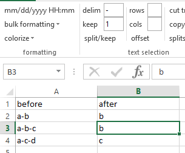
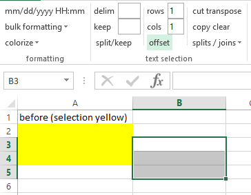
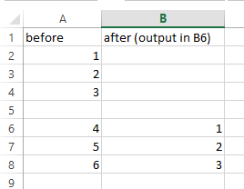
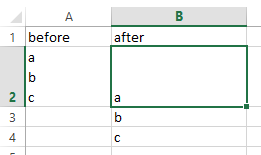
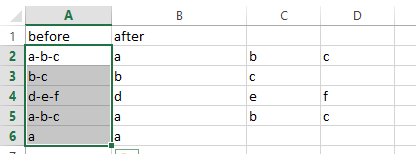

#Text Selection Features
This section contains tools that help with modifying the selected text.  These are general helper methods that find use regularly.

##Split/Keep feature
This feature allows you to split the selected text based on a delimiter and then keep one section of the split out text. Note that the index for which item to keep is 0-based.  When this encounters text that does not contain the delimiter, it will not modify the text.

##Offset selection
This allows you to move the selection by a given number of rows and columns without having to change its size. This works well when you have data that is noncontiguous or is otherwise limiting when trying to use Excel’s built in features.  Note that you can use negative numbers to move the other direction (right and up).

##Cut Transpose
This feature allows for performing a transpose operation using a cut.  Excel currently only allows a transpose when doing a copy/paste.  The difference with using the cut is that it will move the formulas that are affected instead of copying them.
This feature works off the current selection and prompts for the desired output location.  It is advised that you do not allow the output range to overlap the input range.  This is not explicitly forbidden, but it will lead to unexpected behavior depending on what order the cells are moved.

##Copy clear
The “copy clear” is another addition to supplement what Excel already offers.  This simply copies the current cells and pastes them somewhere.  At the end, it clears the original range so that it is blank.  This saves a step or two from the normal copy/paste since you usually lose selection on the range that was copied, making it harder to clear later.  This also works on the current selection.

##Split Join menu
This menu includes several options for splitting the current selection.  Each option is explained individually.

###Split into rows
This takes the current selection and splits it on the new line character.  This works with text in cells that spans multiple lines because of the wrap text option.  This is also useful when text is copied from another source but not split correctly.  This will prompt for the output location.  Make sure there is enough space for the new text; it will not warn about clearing old data.  The original text is left intact.

The selected cell has text which was entered with ALT+ENTER to create lines within the cell.	After using this, it is split across rows.

###Join
The join works to combine cells in a row into a single column.  It asks for the input range, delimiter, and output range.

Multiple cells selected.	Output is put where requested.  Desired delimiter was a comma.

###Split into columns
This is the opposite of the join.  It takes the current selection and splits it using the desired delimiter.  The output goes immediately next to the input.  It will override those columns without asking.  Be careful.

Example of usage.	Same example but copied to multiple cells.  It will process each row individually.

